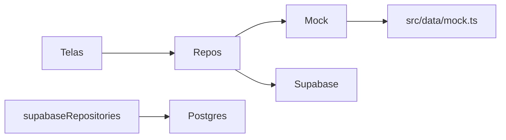

# Guia Flui — decisões, identidade e acessibilidade

Relatório acadêmico (Enterprise Challenge FIAP × Flui). Cada bloco segue **contexto → decisão → justificativa**. A seção de acessibilidade descreve os recursos que o app já oferece ao motorista.

Setup, ícones e distribuição continuam em [SETUP.md](SETUP.md) e [BRANDING.md](BRANDING.md).

---

## 1. Contexto

O Guia Flui ajuda motoristas de veículos elétricos a **encontrar, comparar e escolher** pontos de recarga. O briefing do desafio pede mapa, ficha do posto, filtros, motion e identidade visual coerente. Os dados do mapa **podem ser simulados**.

**Decisão.** Entregar um app nativo (Expo 56 / React Native) com duas fontes de dados no mesmo contrato: **mock local** e **Supabase**. A tela nunca importa `src/data/` nem o cliente SQL direto.

**Justificativa.** A simulação atende a demo e o critério do briefing. O backend real cobre login, favoritos e avaliações, que o mock sozinho não persiste entre aparelhos. O padrão repositório isola essa troca ([`src/repositories/index.ts`](../src/repositories/index.ts)).

---

## 2. O que deve estar presente

### Mapa interativo

**Contexto.** Visualizar postos com marcadores diferenciados, no Google Maps.

**Decisão.** Mapa nativo em [`src/components/MapaExplorar.native.tsx`](../src/components/MapaExplorar.native.tsx). Pins em [`MapMarkerPin.tsx`](../src/components/MapMarkerPin.tsx) usam [`CompatibilityMark.tsx`](../src/components/CompatibilityMark.tsx): raio (compatível), o mesmo raio com borda tracejada (parcial), raio cortado (`ZapOff`, incompatível). Localização do usuário: círculo verde com ícone de carro ([`UserLocationPulse.tsx`](../src/components/UserLocationPulse.tsx)). Pins de posto **não** pulsam — `tracksViewChanges` em massa congelava o mapa.

**Justificativa.** O briefing pede Google Maps e marcadores distintos. Forma + cor (não só verde/amarelo/vermelho) atende daltonismo. Dados vêm do mock ou do Supabase, conforme o modo mockado.

### Ficha detalhada do ponto

**Contexto.** Informar carregadores, conectores, potência, horários, menor movimento e amenidades.

**Decisão.** Tela [`src/app/eletroposto/[id].tsx`](../src/app/eletroposto/[id].tsx): nome, nota, aberto/fechado, endereço, horário de funcionamento, barra de compatibilidade, carrossel de conectores (tipo e kW), **horário de menor movimento** no formato `10-12h`, tempo de recarga, amenidades (banheiro, comida, estacionamento), avaliações e CTA **Seguir rota**.

**Fora da ficha de propósito:** tempo de fila, bloco de segurança e “última rota”. O schema ainda pode guardar fila e segurança; a UI prioriza o que o motorista usa na hora de parar.

**Justificativa.** Fila e “segurança” sem fonte confiável viram ruído. “Última rota” saiu do escopo: a rota existe no fluxo **Seguir rota** (`src/app/rota/[id].tsx`), não como histórico na ficha.

### Filtros de busca

**Contexto.** Filtrar por conector, potência, amenidades e horário.

**Decisão.** [`src/features/explorar/filtros.ts`](../src/features/explorar/filtros.ts): conector (CCS2, Tipo 2, CHAdeMO), potência mínima (50 / 150 kW), banheiro, comida, estacionamento, **aberto agora**, além de distância máxima e “apenas compatíveis” com o veículo ativo.

**Justificativa.** Os quatro critérios do briefing estão cobertos. Compatível e distância são o mesmo domínio (o carro do usuário) e evitam uma lista inútil no mapa.

### Motion design

**Contexto.** Transições, loading e feedback fluidos.

**Decisão.** React Native Reanimated nas entradas de tela (`FadeIn` 400 ms em Home, Favoritos, Perfil e detalhe), popup do mapa (`FadeInDown` ~280 ms), sheet de resultados com spring, slide da welcome ([`SlideToStart.tsx`](../src/components/SlideToStart.tsx)), estrelas da avaliação com spring. Stack: `slide_from_right` nas fichas; fade no grupo de autenticação. Loading: `ActivityIndicator` com `accessibilityRole="progressbar"`.

**Justificativa.** Motion **funcional**: confirma mudança de tela e estado, sem atrasar a tarefa. Duração curta (180–400 ms) e spring com `overshootClamping` no slide para o polegar não sair da trilha.

### Identidade visual consolidada

**Contexto.** Coerência em todas as telas.

**Decisão.** Tokens em [`src/constants/theme.ts`](../src/constants/theme.ts): fundo `#131313`, cards `#1E1E1F` → `#282829`, accent `#31FE50`. **Poppins** quase em todo o app; **Lexend Giga** só no nome do carro (`VehicleCard`). Voltar único ([`BackButton.tsx`](../src/components/BackButton.tsx)), empty states e títulos no mesmo padrão (Favoritos centralizado, telas de perfil sem faixa cinza no topo).

**Justificativa.** Uma paleta e um componente de voltar evitam “outro app” a cada tela. Lexend no carro marca o veículo sem poluir títulos e botões.

---

## 3. Banco de dados e fonte de dados

### Duas fontes, um contrato

**Contexto.** O briefing admite dados simulados; o produto também precisa de conta e persistência.

**Decisão.** Interfaces em [`src/repositories/interfaces.ts`](../src/repositories/interfaces.ts). Implementações mock ([`mockRepositories.ts`](../src/repositories/mockRepositories.ts)) e remotas ([`supabaseRepositories.ts`](../src/repositories/supabaseRepositories.ts)). O toggle **Modo mockado** (Configurações, AsyncStorage `@rota/mock_mode`) escolhe a fonte em runtime.

**Justificativa.** Demo de banca e desenvolvimento sem rede usam o mock. Login, favorito e avaliação reais usam Postgres. As telas não mudam.

### Supabase (Postgres, Auth, RLS)

**Contexto.** Precisávamos de usuários, estações, avaliações e favoritos com regras de acesso.

**Decisão.** Um projeto Supabase do time: `profiles`, `stations`, `reviews`, `favorites`, veículos, papel admin. Migrations em [`supabase/migrations/`](../supabase/migrations/). O app usa a chave **anon**; o painel `admin/` usa o mesmo banco.

**Justificativa.** Auth nativo (email/senha), RLS por `user_id` e seed para demo. Não é Firebase nem REST próprio: o prazo acadêmico pedia menos superfície de backend.

### Horário de menor movimento — campo nosso, não Popular Times

**Contexto.** O briefing pede “períodos de menor movimento”. A Google Places API **não** expõe Popular Times para o app.

**Decisão.** Coluna `horario_menor_movimento` na estação. Exibição só com horas, um período, sem zero à esquerda: `10-12h` ([`src/lib/horarioEstacao.ts`](../src/lib/horarioEstacao.ts)).

**Justificativa.** Não afirmar dado do Google que a API não entrega. O valor pode ser seed/mock ou cadastro no admin. Arredondar para hora inteira deixa a ficha legível no celular.

### O que permanece no schema e saiu da UI

**Contexto.** Modelo inicial tinha fila, pontuação de segurança e “última rota” na experiência.

**Decisão.** `tempo_fila_minutos` e campos de segurança continuam no banco/mock e no mapper. A ficha **não** mostra fila nem o bloco Segurança. Histórico de última rota não entra no perfil.

**Justificativa.** Sem sensor de fila nem fonte de segurança auditável, exibir o número seria teatro. Seguir rota continua; o que saiu foi o atalho de “última viagem” na conta.

### O que o app não faz (dados)

Não há upload de foto de perfil, troca de senha na UI, push notification real nem sincronização com Popular Times. Preferências de notificação ficam só no aparelho (`AsyncStorage`).

---

## 4. Motion e feedback (detalhe)

**Contexto.** Motion no briefing não é vinheta: é transição, loading e resposta ao toque.

**Decisão.**

| Onde | O que | Por quê |
|--------|--------|---------|
| Home, Favoritos, Perfil, detalhe | `FadeIn` 400 ms | A tela “chega”; o conteúdo não aparece cortado |
| Popup do mapa | `FadeInDown` ~280 ms, spring | O card nasce do pin, sem cobrir o mapa de uma vez |
| Lista de resultados (Explorar) | Spring no sheet | Abrir/fechar sem salto |
| Welcome | Slide com carro; reset ao focar de novo | Gesto de “entrar no fluxo”; se não resetar, o gesto fica travado ao voltar do login |
| Avaliação | Spring nas estrelas | Feedback tátil-visual da nota |
| Auth | Fade entre welcome / login / cadastro | Menos ruído que slide em onboarding |
| Fichas e perfil | `slide_from_right` | Hierarquia de navegação |

**Justificativa.** Quem usa leitor de tela não depende dessas animações: o slide da welcome tem ação **ativar**; o loading tem papel `progressbar`. A animação visual permanece para quem vê.

---

## 5. Melhorias recentes de interface

**Voltar único.** Todas as setas (eletroposto, cadastro, login, avaliar, rota, configurações) usam [`BackButton`](../src/components/BackButton.tsx): 40×40, `ArrowLeft` 20 px, sem círculo. **Justificativa.** O padrão de Configurações era o mais limpo; círculos diferentes em cada tela quebravam a identidade.

**Favoritos.** Título centralizado; empty state no meio da área acima da tab bar; CTA “Encontrar Recarga”. **Justificativa.** Mesmo shell da Home/Perfil; estado vazio precisa de saída, não só de texto.

**Teclado.** `ScreenContainer` com `keyboard` envolve `KeyboardAvoidingView` + `ScrollView`. Login, cadastro e avaliar rolam com o teclado aberto. **Justificativa.** O formulário estava em `flex: 1` sem scroll; o teclado cobria o link “Já tem conta?”.

**Criar conta → login.** `router.dismissTo('/(auth)/login')`, não `back()`. **Justificativa.** `back()` caía na welcome (start) por causa da pilha do grupo `(auth)`.

**Metro estável.** Porta **8083**, hostname `127.0.0.1`, `npm run metro` reinicia se o processo cair. **Justificativa.** O simulador pede IPv4; bind só em `::1` gerava “Could not connect to development server”. Sem o watcher, o Metro podia cair sem o app perceber.

---

## 6. Acessibilidade

Acessibilidade é o conjunto de recursos que permitem usar o app **sem depender só da visão, da precisão do toque ou do movimento na tela**. No celular, isso passa principalmente pelo leitor de tela (**VoiceOver** no iOS, **TalkBack** no Android), pelo tamanho de fonte do sistema e por alvos de toque usáveis.

O Guia Flui trata isso como uma **interface paralela**: quem não usa leitor de tela vê o app igual; quem usa ouve nomes, estados e mudanças em português. Os helpers ficam em [`src/lib/a11y.ts`](../src/lib/a11y.ts).

Cada recurso abaixo descreve **o que é**, **como impacta** e **o objetivo**. No fim de cada um, se o app **já usa**.

### Leitor de tela (rótulo, dica e papel)

**O que é.** O leitor de tela fala o que está em foco. O app informa o **nome** (`accessibilityLabel`), **para que serve** (`accessibilityHint`) e o **tipo** (`accessibilityRole`: botão, título, busca, imagem…).

**Como impacta.** Sem nome, um ícone vira só “botão”. Com nome, a pessoa sabe que é “Voltar”, “Filtros” ou “Email” — e não o placeholder (`exemplo@email.com`).

**Objetivo.** Toda ação e informação importante ser compreensível sem ver a tela.

**Já usado.** Botões, abas, cards, busca, voltar, markers do mapa, detalhe do eletroposto, interruptores e chips dos filtros, campos de login, cadastro, perfil e veículo. O slide da welcome também tem nome (“Iniciar”).

### Estado (ligado, selecionado, desabilitado, carregando)

**O que é.** Além do nome, o leitor fala o **estado** do controle: aba ativa, favorito marcado, interruptor ligado, chip selecionado, botão indisponível, “carregando”.

**Como impacta.** Sem estado, filtrar “Aberto agora” ou favoritar não confirma se deu certo. A pessoa não sabe se a aba já é a atual ou se o botão está bloqueado.

**Objetivo.** Dar feedback da ação, não só identificar o controle.

**Já usado.** Abas, favorito, botão desabilitado, carregamento, switches de filtros e de configurações (`checked`), chips de filtro (`selected`).

### Elementos decorativos

**O que é.** Ícone, gradiente, fade ou imagem que **não acrescenta informação**. Marcados para o leitor ignorar (`aria-hidden` / `accessible={false}`).

**Como impacta.** Sem isso, o leitor fala duas vezes (“estrela, avaliação 4.4”) ou lê “imagem” sem sentido na foto de fundo da welcome.

**Objetivo.** Ouvir só o que importa, uma vez.

**Já usado.** Ícones de cards, busca, popup do mapa e sheets; gradientes e fades; foto de fundo da welcome. O container pai concentra o rótulo.

### Área de toque

**O que é.** Extra de 12px (`HIT_SLOP_PADRAO`) em botões pequenos — voltar, filtros, fechar, favorito — sem aumentar o desenho do ícone.

**Como impacta.** Quem tem menos precisão no toque acerta o alvo. O layout visual não muda.

**Objetivo.** Alvos pequenos continuarem usáveis.

**Já usado.** Botões só com ícone no app, inclusive o de filtros no web, no mesmo nível do nativo.

### Escala de fonte do sistema

**O que é.** O texto do app cresce com o tamanho de fonte definido no iOS ou no Android. Os campos **não** bloqueiam `allowFontScaling`.

**Como impacta.** Quem tem baixa visão lê sem um “modo acessível” separado no app.

**Objetivo.** Respeitar a escolha do sistema.

**Já usado.** Textos e inputs em geral. Exceção proposital: a letra inicial do avatar (cabe no círculo).

### Anúncios dinâmicos

**O que é.** O app fala sozinho uma mudança que **não está no foco** (`anunciarMensagem` em `src/lib/a11y.ts`). Só dispara se o leitor de tela estiver ligado.

**Como impacta.** Depois de buscar, filtrar ou favoritar, o resultado muda fora do controle atual. Sem anúncio, a pessoa não fica sabendo. O mesmo vale para um erro que aparece num alerta.

**Objetivo.** Mudanças importantes chegarem ao leitor sem ela ter que caçar na tela.

**Já usado.**

- Busca: “X resultados encontrados”
- Filtros aplicados: mesma contagem
- Favoritar / desfavoritar
- Falha ao buscar, ao salvar favorito, ao entrar, cadastrar, editar perfil, salvar o carro ou publicar avaliação

### Modal (um contexto por vez)

**O que é.** Com `accessibilityViewIsModal`, o leitor trata o sheet aberto como a tela atual e **não lê o que está atrás**.

**Como impacta.** Sem isso, ao abrir filtros a pessoa ainda “esbarra” no mapa e na busca, e se perde.

**Objetivo.** Um contexto por vez.

**Já usado.** Sheet de filtros e sheet de explicação de compatibilidade.

### Alternativa a gesto customizado

**O que é.** O slide “Iniciar” da welcome também dispara com a ação **ativar** do leitor (`accessibilityActions`), sem arrastar.

**Como impacta.** Arrastar um controle customizado é ruim ou impossível com VoiceOver. Ativar pelo leitor cumpre a mesma ação. A animação visual permanece.

**Objetivo.** O gesto para quem vê; outro caminho para quem usa o leitor.

**Já usado.** `SlideToStart` — a animação não foi alterada por acessibilidade.

### Contraste de texto

**O que é.** Texto precisa de contraste suficiente com o fundo (WCAG AA: **4.5:1** para texto normal). No Guia Flui o cinza secundário (`textMuted`) é o tom mais baixo da paleta.

**Como impacta.** Cinza demais some no fundo escuro. Quem tem baixa visão deixa de ler endereço, dica e ícone inativo da tab bar.

**Objetivo.** Manter o visual escuro e ainda cumprir AA no pior fundo usado para texto (`elevated` `#252526`).

**Já usado.** `textMuted` é `#909090`: cerca de **4.8:1** no elevated, **5.8:1** no fundo, **5.2:1** na surface. Texto principal, accent, warning e danger ficam bem acima de 4.5. Borda `#4A4A4A` é decorativa (não é texto) e fica abaixo de 3:1 de componente — de propósito, para não “gritar” a linha.

Não há um segundo tema de alto contraste do sistema.

### Forma, não só cor

**O que é.** Compatível / parcial / incompatível não podem depender só da cor (daltonismo). Aberto / fechado aparece no card e no popup, em texto.

**Como impacta.** Se o pin só muda a borda de verde para amarelo, quem não distingue essas cores vê o mesmo mapa. O leitor de tela **já falava** o texto; quem **olha** o mapa não.

**Objetivo.** O mesmo estado ser reconhecível por forma, além da cor.

**Já usado.** O raio (`Zap`) no mapa, no card e no detalhe. Parcial: o mesmo raio, com borda **tracejada** no pin. Incompatível: raio cortado (`ZapOff`). Aberto ou fechado: badge “Aberto agora” / “Fechado” no card, no popup do mapa e no detalhe — o pin não muda por horário.

### Como isso é montado no código

`src/lib/a11y.ts` concentra:

| Recurso | Função |
|--------|--------|
| `HIT_SLOP_PADRAO` | Área de toque extra de 12px |
| `criarRotuloEletroposto()` | Nome, compatibilidade, distância, fila, carga, conectores, aberto |
| `criarRotuloCompatibilidade()` | Compatível / Parcial / Incompatível |
| `criarRotuloAvaliacao()` | Ex.: *Avaliação 4.4 de 5, 45 avaliações* |
| `criarRotuloVeiculo()` | Marca, modelo e autonomia |
| `anunciarMensagem()` | Fala a mudança só se o leitor estiver ativo |

Mapa e cards: `CompatibilityMark` (ícone por nível de compatibilidade).

Papéis semânticos recorrentes: `button`, `header`, `search`, `progressbar`, `image`, `adjustable` (slide da welcome).

### Como testar

1. Ative o leitor de tela:
   - **iOS:** Ajustes → Acessibilidade → VoiceOver
   - **Android:** Configurações → Acessibilidade → TalkBack
2. Navegue: Home → Explorar → detalhe de um posto → favoritar → Perfil.
3. Na busca e ao aplicar filtros, confirme o anúncio da quantidade de resultados.
4. Confirme que ícones decorativos não são lidos junto com o texto.
5. Nos filtros, ouça o interruptor **ligado/desligado** e o chip **selecionado**.
6. Na welcome, ative o slide pelo leitor (sem arrastar) e confira que a animação visual segue igual para quem não usa leitor.
7. No mapa, confira que parcial usa o **mesmo raio** com borda tracejada. Aberto/fechado aparece no card e no popup, não no pin.

